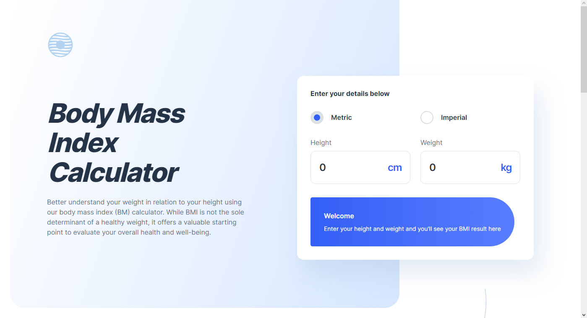

# Frontend Mentor - Body Mass Index Calculator solution

This is a solution to the [Body Mass Index Calculator challenge on Frontend Mentor](https://www.frontendmentor.io/challenges/body-mass-index-calculator-brrBkfSz1T). Frontend Mentor challenges help you improve your coding skills by building realistic projects. 

## Table of contents

- [Frontend Mentor - Body Mass Index Calculator solution](#frontend-mentor---body-mass-index-calculator-solution)
  - [Table of contents](#table-of-contents)
  - [Overview](#overview)
    - [The challenge](#the-challenge)
    - [Screenshot](#screenshot)
    - [Links](#links)
  - [My process](#my-process)
    - [Built with](#built-with)
    - [What I learned](#what-i-learned)
    - [Continued development](#continued-development)
    - [Useful resources](#useful-resources)
  - [Author](#author)

## Overview
  Doing this project was incredible, I finally feel that I have assimilated all the knowledge I gained in these 3 months that I decided to try to study html and css again. I feel that I still haven't used much of the functionality of SASS, but I still used many of them, such as mixins and variables.
### The challenge

Users should be able to:

- Select whether they want to use metric or imperial units
- Enter their height and weight
- See their BMI result, with their weight classification and healthy weight range
- View the optimal layout for the interface depending on their device's screen size
- See hover and focus states for all interactive elements on the page

### Screenshot



### Links

- Solution URL: [Github](https://github.com/Rickrasin/BMI-Calculator)
- Live Site URL: [BMI Calculator](https://rickrasin.github.io/BMI-Calculator/)

## My process

### Built with

- Semantic HTML5 markup
- CSS custom properties
- Flexbox
- CSS Grid
- [SASS](https://sass-lang.com) - CSS Precompiler

### What I learned

My JS isn't very tidy, but I've always made forms without putting the option to select text on click. Now that I've learned that, I've evolved another level in user accessibility.

```js

Array.from(inputs).forEach(function (input) {
  input.addEventListener("click", function () {
    this.select();
  });
});

```
I know it has nothing to do with the code, but I got some pretty crazy calculations programming this page. I was banging my head for a long time, I was first multiplying all my BMI ranges by height², until it dawned on me that I just needed to multiply by the healthy range to get the ideal minimum and maximum weight.

```js
function GetIdealWeight(height, isImperial) {
  let idealWeightRange;
  let height2 = (height / 100) * (height / 100);
  let min;
  let max;

  min = 18.6 * height2;
  max = 24.9 * height2;

  if (!isImperial) {
    min = Math.round(min * 100) / 100;
    max = Math.round(max * 100) / 100;
    idealWeightRange = `${min.toFixed(1)}kgs - ${max.toFixed(1)}kgs`;
  } else {
    const minSt = Math.floor(min / 6.35029);
    const minLbs = Math.round(((min / 6.35029) % 1) * 14);

    const maxSt = Math.floor(max / 6.35029);
    const maxLbs = Math.round(((max / 6.35029) % 1) * 14);

    console.log();

    idealWeightRange = `${minSt.toFixed(0)}st ${minLbs.toFixed(
      0
    )}lbs - ${maxSt.toFixed(0)}st ${maxLbs.toFixed(0)}lbs`;

    console.log(minSt + "minSt ");
    console.log("minLbs " + maxLbs);
    console.log("maxSt " + maxSt);
    console.log("maxLbs " + maxLbs);
  }

  console.log(idealWeightRange);
  return idealWeightRange;
}

```

### Continued development

I had taken a break from studying Unity and C# to focus on frontend, as I noticed that every professional programmer with a job in the area knew frontend, even if it wasn't their main area. Now I can proudly say that I have a certain mastery of Frontend Vanilla,
my focus now is to go back to developing my games and mastering a powerful framework like React or Flutter.

### Useful resources

- [SASS e SCSS do básico ao avançado](https://www.udemy.com/course/sass-e-scss-do-basico-ao-avancado-projetos/) - I learned how to work with SASS with a course on udemy. I'll leave his name here for others who read this and need it.


## Author

- Linkedin - [Rickson](https://www.linkedin.com/in/rickson-oliveira-44331822b/)
- Frontend Mentor - [@Rickrasin](https://www.frontendmentor.io/profile/Rickrasin)
- Twitter - [@RicksonOlivei20](https://www.twitter.com/RicksonOlivei20)

